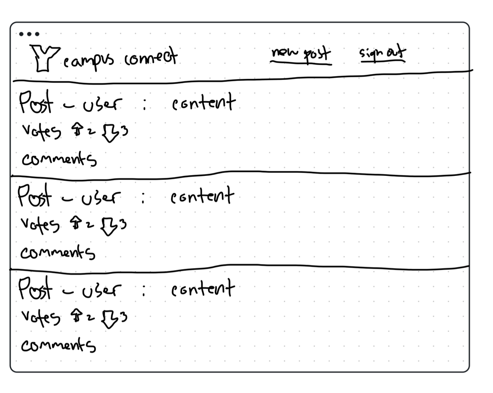

# Campus Connect

[My Notes](notes.md)

Campus Connect is an online platform with the goal of connecting students to their campus. It is an online forum where people can post announce activites, make connections, chat about what's going on in their community, and more.

## 🚀 Specification Deliverable

> [!NOTE]
>  Fill in this sections as the submission artifact for this deliverable. You can refer to this [example](https://github.com/webprogramming260/startup-example/blob/main/README.md) for inspiration.

For this deliverable I did the following. I checked the box `[x]` and added a description for things I completed.

- [x] Proper use of Markdown
- [x] A concise and compelling elevator pitch
- [x] Description of key features
- [x] Description of how you will use each technology
- [x] One or more rough sketches of your application. Images must be embedded in this file using Markdown image references.

### Elevator pitch

Have you ever felt lost within a crowd in a new city or campus? Campus Connect will fix that. Within minitues you'll be able to discover new activies, find new friends, and feel more connected with your campus and your community. From sports to arts, clubs, groups, and beyond, this is a game changer for all things college life.

### Design

### Key features

- Secure login over HTTPS
- Select campus to see sepecific Campus Connect Board
- Post a topic of discussion
- Vote on discussion topics
- Vote counts update in real time
- Comment on discussion topics
- Admin can delete posts to maintain community standards

### Technologies

I am going to use the required technologies in the following ways.

- **HTML** - Use correct HTML structure for application. Sign Up and Login pages, Campus Connect Board page, view post page.
- **CSS** - Unique and creative coloring, good styling that looks good on any size screen. Simple layout.
- **React** - Provides login, Campus Connect Board view, handles user votes and comments, handles routing and reusable components.
- **Service** - Backend service with endpoints for:
    - login
    - retrieving posts
    - submitting post
    - submitting comment
    - submitting vote
- **DB/Login** - Store users, posts, and comments in database. Register and login users. Credentials stored securely in database. Can't post, comment, or vote unless authenticated.
- **WebSocket** - As posts, comments, or votes are submitted, they are broadcast to all other users.

## 🚀 AWS deliverable

For this deliverable I did the following. I checked the box `[x]` and added a description for things I completed.

- [ ] **Server deployed and accessible with custom domain name** - [My server link](https://yourdomainnamehere.click).

## 🚀 HTML deliverable

For this deliverable I did the following. I checked the box `[x]` and added a description for things I completed.

- [ ] **HTML pages** - I did not complete this part of the deliverable.
- [ ] **Proper HTML element usage** - I did not complete this part of the deliverable.
- [ ] **Links** - I did not complete this part of the deliverable.
- [ ] **Text** - I did not complete this part of the deliverable.
- [ ] **3rd party API placeholder** - I did not complete this part of the deliverable.
- [ ] **Images** - I did not complete this part of the deliverable.
- [ ] **Login placeholder** - I did not complete this part of the deliverable.
- [ ] **DB data placeholder** - I did not complete this part of the deliverable.
- [ ] **WebSocket placeholder** - I did not complete this part of the deliverable.

## 🚀 CSS deliverable

For this deliverable I did the following. I checked the box `[x]` and added a description for things I completed.

- [ ] **Header, footer, and main content body** - I did not complete this part of the deliverable.
- [ ] **Navigation elements** - I did not complete this part of the deliverable.
- [ ] **Responsive to window resizing** - I did not complete this part of the deliverable.
- [ ] **Application elements** - I did not complete this part of the deliverable.
- [ ] **Application text content** - I did not complete this part of the deliverable.
- [ ] **Application images** - I did not complete this part of the deliverable.

## 🚀 React part 1: Routing deliverable

For this deliverable I did the following. I checked the box `[x]` and added a description for things I completed.

- [ ] **Bundled using Vite** - I did not complete this part of the deliverable.
- [ ] **Components** - I did not complete this part of the deliverable.
- [ ] **Router** - Routing between login and voting components.

## 🚀 React part 2: Reactivity

For this deliverable I did the following. I checked the box `[x]` and added a description for things I completed.

- [ ] **All functionality implemented or mocked out** - I did not complete this part of the deliverable.
- [ ] **Hooks** - I did not complete this part of the deliverable.

## 🚀 Service deliverable

For this deliverable I did the following. I checked the box `[x]` and added a description for things I completed.

- [ ] **Node.js/Express HTTP service** - I did not complete this part of the deliverable.
- [ ] **Static middleware for frontend** - I did not complete this part of the deliverable.
- [ ] **Calls to third party endpoints** - I did not complete this part of the deliverable.
- [ ] **Backend service endpoints** - I did not complete this part of the deliverable.
- [ ] **Frontend calls service endpoints** - I did not complete this part of the deliverable.

## 🚀 DB/Login deliverable

For this deliverable I did the following. I checked the box `[x]` and added a description for things I completed.

- [ ] **User registration** - I did not complete this part of the deliverable.
- [ ] **User login and logout** - I did not complete this part of the deliverable.
- [ ] **Stores data in MongoDB** - I did not complete this part of the deliverable.
- [ ] **Stores credentials in MongoDB** - I did not complete this part of the deliverable.
- [ ] **Restricts functionality based on authentication** - I did not complete this part of the deliverable.

## 🚀 WebSocket deliverable

For this deliverable I did the following. I checked the box `[x]` and added a description for things I completed.

- [ ] **Backend listens for WebSocket connection** - I did not complete this part of the deliverable.
- [ ] **Frontend makes WebSocket connection** - I did not complete this part of the deliverable.
- [ ] **Data sent over WebSocket connection** - I did not complete this part of the deliverable.
- [ ] **WebSocket data displayed** - I did not complete this part of the deliverable.
- [ ] **Application is fully functional** - I did not complete this part of the deliverable.
