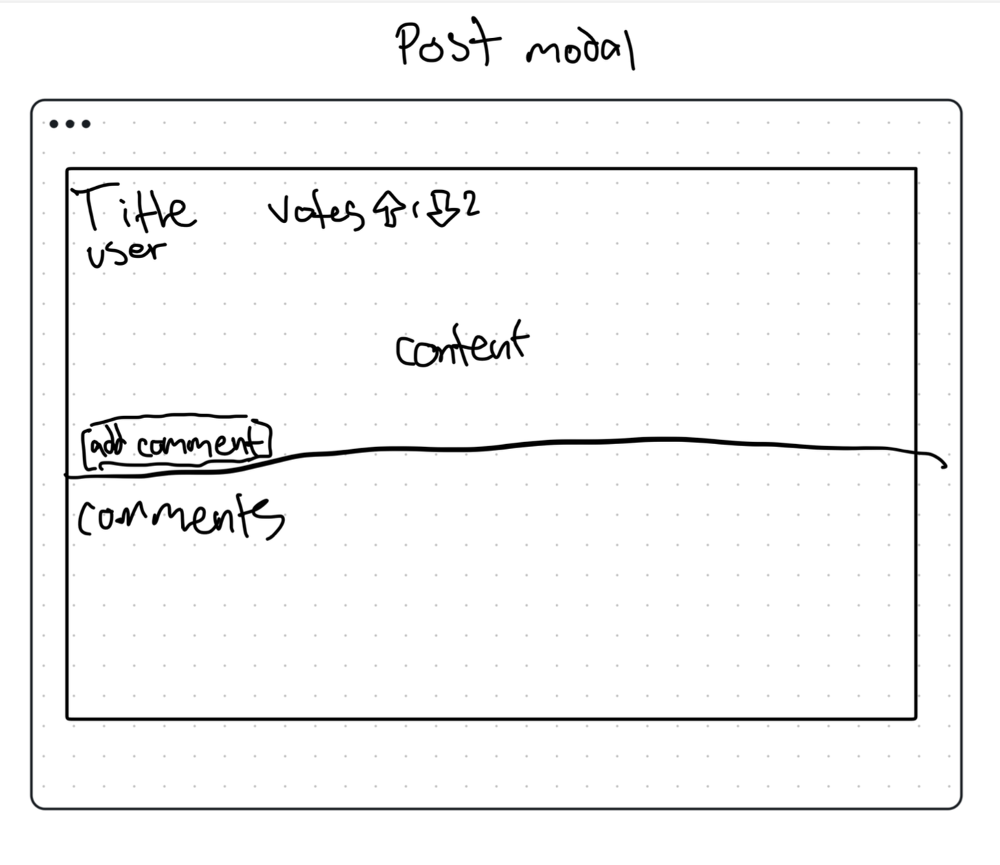

# Campus Connect

<!-- [My Notes](notes.md) -->

Campus Connect is an online platform with the goal of connecting students to their campus. It is an online forum where people can post announce activites, make connections, chat about what's going on in their community, and more.

## 🚀 Specification Deliverable

<!-- > [!NOTE]
>  Fill in this sections as the submission artifact for this deliverable. You can refer to this [example](https://github.com/webprogramming260/startup-example/blob/main/README.md) for inspiration. -->

For this deliverable I did the following. I checked the box `[x]` and added a description for things I completed.

- [x] Proper use of Markdown
- [x] A concise and compelling elevator pitch
- [x] Description of key features
- [x] Description of how you will use each technology
- [x] One or more rough sketches of your application. Images must be embedded in this file using Markdown image references.

### Elevator pitch

Have you ever felt lost within a crowd in a new city or campus? Campus Connect will fix that. Within minitues you'll be able to discover new activies, find new friends, and feel more connected with your campus and your community. From sports to arts, clubs, groups, and beyond, this is a game changer for all things college life.

### Design

### Key features

- Secure login over HTTPS
- Select campus to see sepecific Campus Connect Board
- Post a topic of discussion
- Vote on discussion topics
- Vote counts update in real time
- Comment on discussion topics
- Admin can delete posts to maintain community standards

### Technologies

I am going to use the required technologies in the following ways.

- **HTML** - Use correct HTML structure for application. Sign Up and Login pages, Campus Connect Board page, view post page.
- **CSS** - Unique and creative coloring, good styling that looks good on any size screen. Simple layout.
- **React** - Provides login, Campus Connect Board view, handles user votes and comments, handles routing and reusable components.
- **Service** - Backend service with endpoints for:
    - login
    - retrieving posts
    - submitting post
    - submitting comment
    - submitting vote
- **DB/Login** - Store users, posts, and comments in database. Register and login users. Credentials stored securely in database. Can't post, comment, or vote unless authenticated.
- **WebSocket** - As posts, comments, or votes are submitted, they are broadcast to all other users.
- **API** - Query 'CollegeFootballData.com' to get the data of the football team of the users selected college.

## 🚀 AWS deliverable

For this deliverable I did the following. I checked the box `[x]` and added a description for things I completed.

- [x] **Server deployed and accessible with custom domain name** - [My server link](https://luke-fairbanks.click).

## 🚀 HTML deliverable

For this deliverable I did the following. I checked the box `[x]` and added a description for things I completed.

- [x] **HTML pages**
- [x] **Proper HTML element usage**
- [x] **Links**
- [x] **Text**
- [x] **3rd party API placeholder**
- [x] **Images**
- [x] **Login placeholder**
- [x] **DB data placeholder**
- [x] **WebSocket placeholder**

## 🚀 CSS deliverable

For this deliverable I did the following. I checked the box `[x]` and added a description for things I completed.

- [x] **Header, footer, and main content body** - I created a consistent header and footer for all pages, ensuring they contain navigation links and branding.
- [x] **Navigation elements** - The navigation bar includes links to all major sections of the application, such as Home, About, Features, and Contact. It is implemented using a `<nav>` element and styled to be visually appealing and user-friendly.
- [x] **Responsive to window resizing** - I used CSS media queries to ensure the layout adapts to different screen sizes. The design is mobile-first, ensuring it looks good on both small and large screens.
- [x] **Application elements** - All interactive elements, such as buttons, forms, and links, are styled consistently. I used CSS classes to ensure a uniform look and feel across the application.
- [x] **Application text content** - The text content is clear, concise, and informative. I used appropriate HTML elements like `<h1>`, `
`, and `<ul>` to structure the content logically.
- [x] **Application images** - Images are optimized for web use and included using `` tags with descriptive `alt` attributes for accessibility. They are styled to be responsive and fit within the layout without breaking the design.

## 🚀 React part 1: Routing deliverable

For this deliverable I did the following. I checked the box `[x]` and added a description for things I completed.

- [x] **Bundled using Vite** - I used Vite to bundle the application, ensuring fast and efficient development and build processes.
- [x] **Components** - I created reusable React components for the login form, voting interface, and discussion board. Each component is modular and can be easily maintained and updated.
- [x] **Router** - I implemented routing using React Router to navigate between the login page and the voting components. This ensures a smooth user experience as they move through different parts of the application.

## 🚀 React part 2: Reactivity

For this deliverable I did the following. I checked the box `[x]` and added a description for things I completed.

- [x] **All functionality implemented or mocked out** - I implemented core functionality including post creation, comment display, and voting mechanisms. The application now allows users to view posts, add comments, and interact with content through voting features.
- [x] **Hooks** - I used React hooks extensively throughout the application. I implemented useState for maintaining component state for posts and user interactions, useEffect for fetching post data and handling side effects, and useContext to manage global application state across components.

## 🚀 Service deliverable

For this deliverable I did the following. I checked the box `[x]` and added a description for things I completed.

## 🚀 Service deliverable

For this deliverable I did the following. I checked the box `[x]` and added a description for things I completed.

- [x] **Node.js/Express HTTP service** - I created a backend service using Node.js and Express to handle API requests. The service manages post data, user interactions, and authentication processes.
- [x] **Static middleware for frontend** - I implemented Express static middleware to serve the React frontend, allowing for seamless integration between the frontend and backend components.
- [x] **Calls to third party endpoints** - The application makes calls to CollegeFootballData.com API to fetch information about the football team of the user's selected college, providing additional contextual information.
- [x] **Backend service endpoints** - I created endpoints for user authentication, post management (create, read), comment submission, and vote handling, enabling the frontend to interact with the database.
- [x] **Frontend calls service endpoints** - The React frontend makes fetch requests to the backend services, allowing users to retrieve posts, submit new content, add comments, and cast votes in real-time.

## 🚀 DB/Login deliverable

For this deliverable I did the following. I checked the box `[x]` and added a description for things I completed.

- [ ] **User registration** - I did not complete this part of the deliverable.
- [ ] **User login and logout** - I did not complete this part of the deliverable.
- [ ] **Stores data in MongoDB** - I did not complete this part of the deliverable.
- [ ] **Stores credentials in MongoDB** - I did not complete this part of the deliverable.
- [ ] **Restricts functionality based on authentication** - I did not complete this part of the deliverable.

## 🚀 WebSocket deliverable

For this deliverable I did the following. I checked the box `[x]` and added a description for things I completed.

- [ ] **Backend listens for WebSocket connection** - I did not complete this part of the deliverable.
- [ ] **Frontend makes WebSocket connection** - I did not complete this part of the deliverable.
- [ ] **Data sent over WebSocket connection** - I did not complete this part of the deliverable.
- [ ] **WebSocket data displayed** - I did not complete this part of the deliverable.
- [ ] **Application is fully functional** - I did not complete this part of the deliverable.
